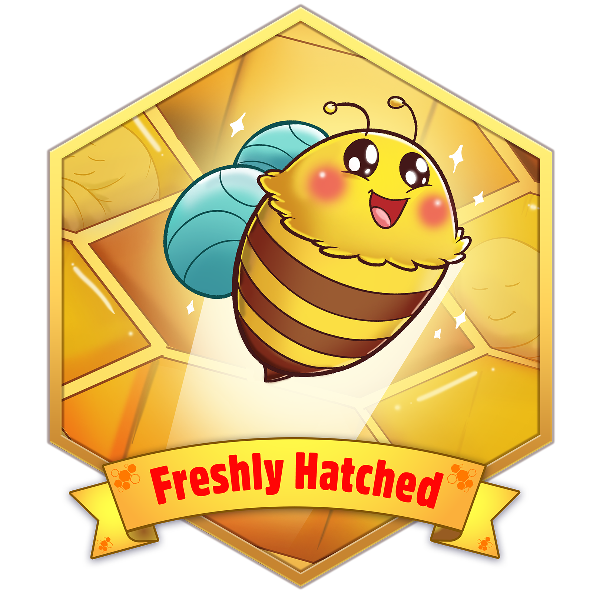
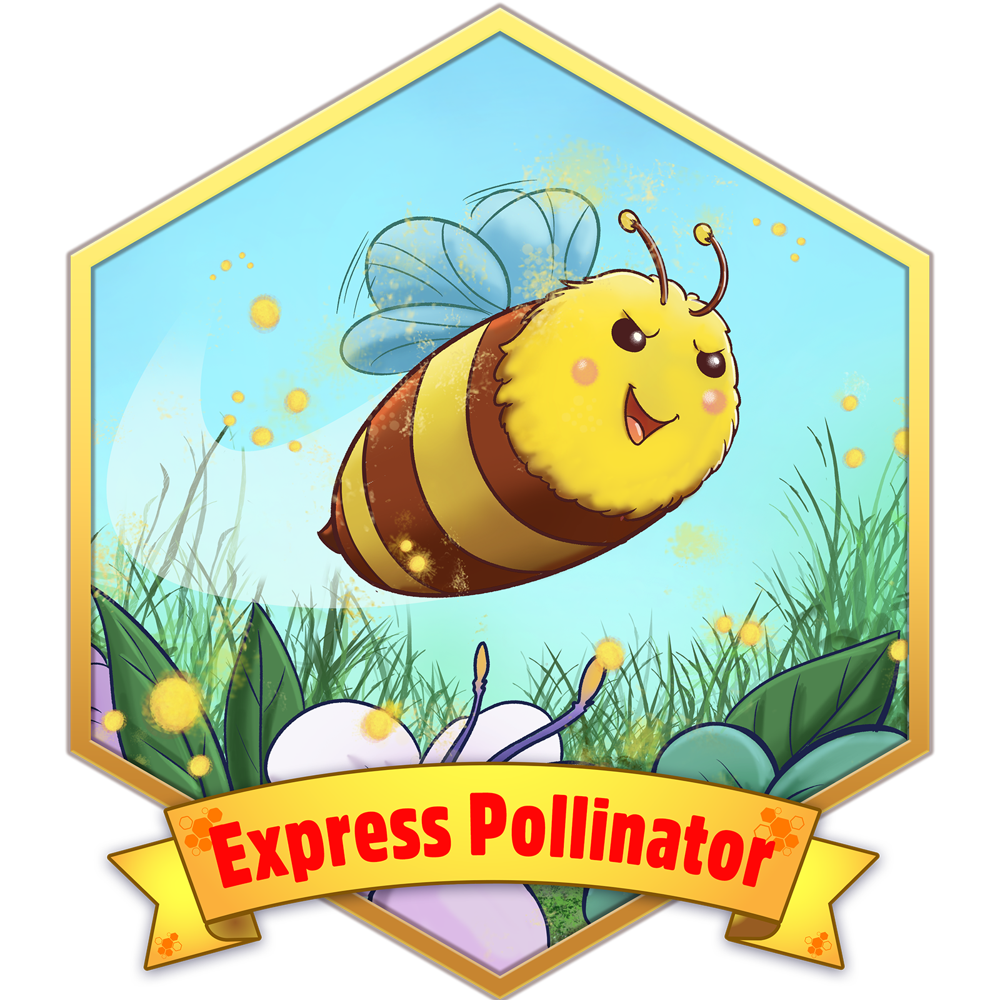
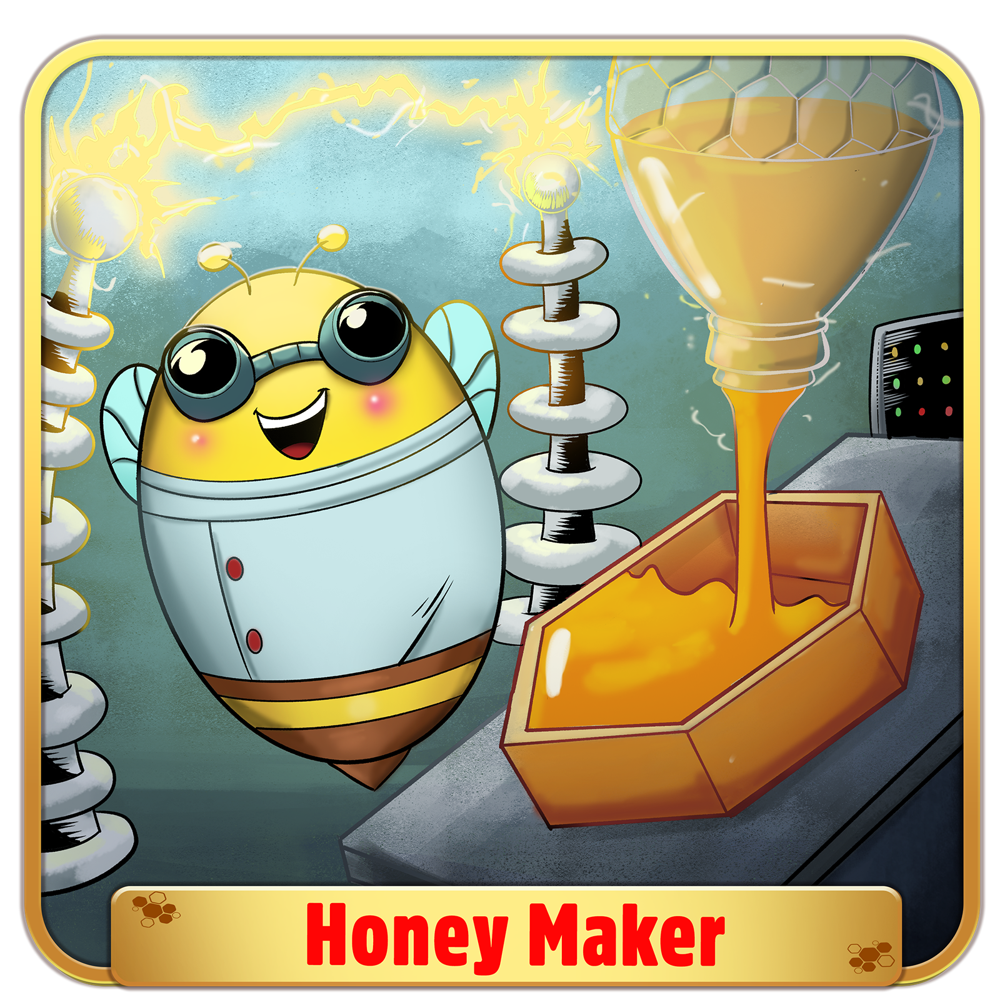

import Image from 'next/image'

# What are Badges?

Badges are unique, visually appealing NFTs awarded 
for specific achievements within the Githoney ecosystem. 
They showcase your skills, contributions, and commitment to 
open source, and they're displayed on your profile page.

## Earning Badges

Badges are awarded automatically when you meet specific criteria.
These criteria can vary, but typically include:

- Completing bounties
- Creating successful bounties
- Sponsoring bounties
- Achieving high reputation scores
- Contributing to the community
- Participating in special events or challenges

## Types of Badges

Each time you earn a badge, there's a chance it could be a rare, one-of-a-kind NFT!

1. **Common Badges** can be earned by multiple users.
2. **Rare Badges** are one-of-a-kind, adding an element of surprise and excitement to the badge-earning process.

## GitHoney Badges

Here's a sneak peek at some of the badges you can collect. We're keeping a few as a surprise! 🐝
### Contributor Badges

* **Freshly Hatched** - Awarded for completing your first bounty.

* **Express Pollinator** -  Earned for completing a bounty within 24 hours of claiming it.

### Maintainer Badges

* **Honey Maker** - Your first bounty was succesfully completed.

### Sponsor Badges

* **Honey Whale** - Awarded for depositing 1000+ ADA in a single bounty.
