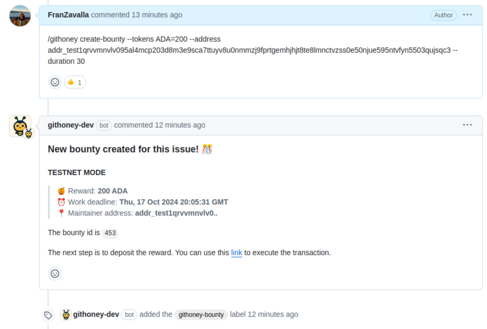
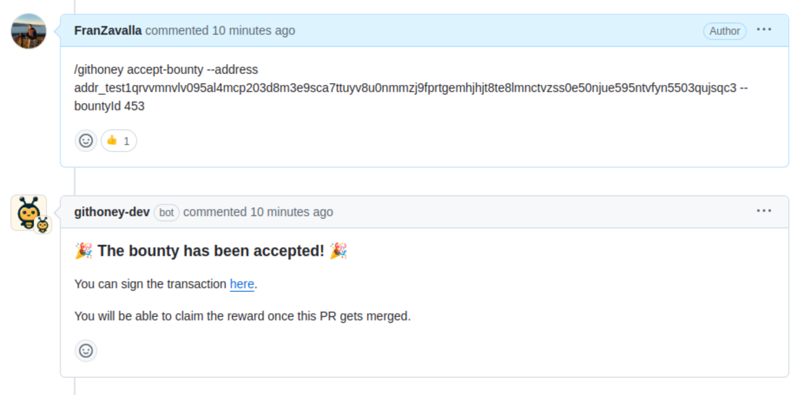
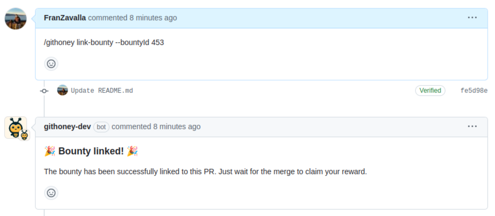
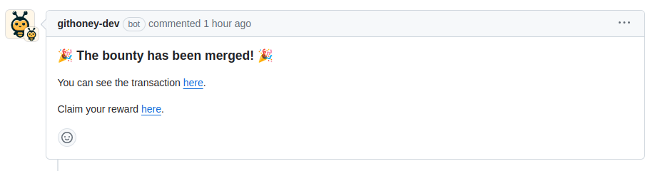

# GitHoney

**GitHoney** is a bounty management system tailored for open-source software development tasks. Its foundation on on-chain smart contracts ensures transparency and strong guarantees for all participants.

One of the key features of GitHoney is its integration with GitHub. It
operates as a bot within GitHub, interacting with users through issues, PRs, and
comments. This bot is responsible for setting up the on-chain contracts and
monitoring all interactions.

**Roles in the Githoney Ecosystem:**

- **Maintainer**: The individual or team responsible for a GitHub repository who has a task they want completed.
- **Contributor**: The skilled individual or team who takes on the challenge and completes the task by submitting a pull request.
- **Sponsor**: An individual or organization who wants to contribute additional funds to an existing bounty, boosting its attractiveness and potentially accelerating its completion.

The process is straightforward: a maintainer attaches a bounty to a GitHub
issue. A contributor can then accept this bounty by starting a new PR
referencing the bounty. Once the PR is completed, reviewed, and merged, the
contributor can claim their reward.

GitHoney provides a simple and transparent approach to incentivize contributions and drive your open-source projects forward.

## Example interaction

The following screenshot shows an interaction with GitHoney bot using
Github to create a bounty to an existing issue. Also, the bot sets a label
to the issue to indicate that it has a bounty.

Below, the contributor accepts the bounty using the GitHoney bot.

Then, the contributor submits a PR referencing the bounty.

Lastly, after the PR is merged, GitHoney informs the Contributor to claim their reward.

